---
hide:
  - navigation
  - toc
---

<!--
  IY BEATS — 18 Поток по Созданию Музыки
  Лендинг-страница (one-pager). Контент пересобран с iypotok.tilda.ws,
  черновик: potoksite/docs/plans/20260928-iybeats-landing-content.md

  TODO перед запуском:
  - [ ] Даты набора (сейчас «набор открыт» без дат)
  - [ ] Цена + кнопка покупки (пока CTA ведёт в VK/TG)
  - [ ] Кто на photo-1/2/3.jpg — сопоставить с карточками преподавателей
  - [ ] Логотип и фавиконка (mkdocs.yml)
-->

IY BEATS · онлайн-курс

# 18 ПОТОК по Созданию Музыки от IY BEATS

Курс позволит вам изучить битмейкинг, сведение и создание музыки с нуля —
от первого бита до релиза на стриминговых площадках.

<ul style="list-style:none; padding:0; margin:0; line-height:2;">
<li><i data-lucide="check-circle-2" style="color:var(--accent-orange)"></i> Написать свои первые треки и биты</li>
<li><i data-lucide="check-circle-2" style="color:var(--accent-orange)"></i> Свободно использовать любые VST плагины</li>
<li><i data-lucide="check-circle-2" style="color:var(--accent-orange)"></i> Сводить и мастерить треки, записывать вокал</li>
<li><i data-lucide="check-circle-2" style="color:var(--accent-orange)"></i> Получить обратную связь по трекам от IY</li>
<li><i data-lucide="check-circle-2" style="color:var(--accent-orange)"></i> Выпустить треки на площадках</li>
</ul>

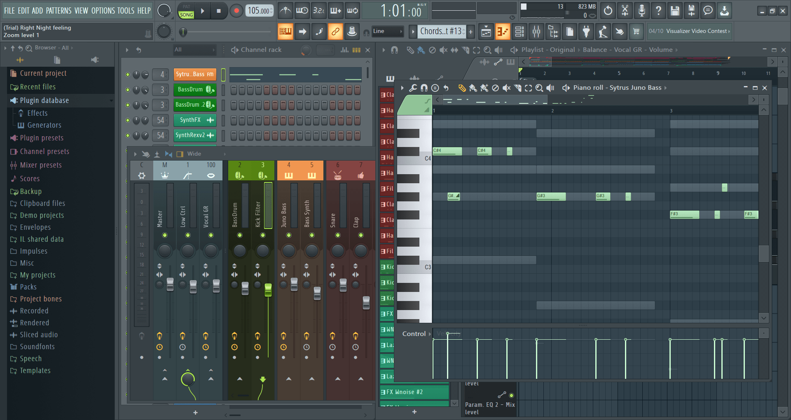
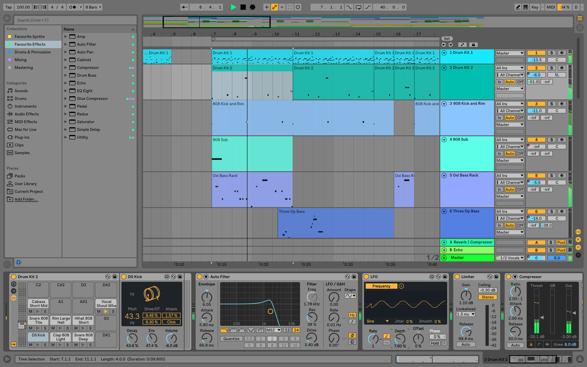
обучаем в FL Studio 25 и Ableton Live 12

<a class="btn-primary" href="#enroll">Записаться на поток</a>
<a class="btn-secondary" href="#program">Смотреть программу</a>

<strong>Набор открыт — старт потока скоро.</strong> 

Лучший поток по созданию музыки. Обратная связь на каждом этапе курса.
<!-- TODO: вписать актуальные даты набора и цену -->

Кому подойдёт

## Курс собран под три ситуации

<i data-lucide="sprout" class="lcard-icon"></i>
<h3>Вы никогда не писали музыку</h3>

Начинаем с нуля: установка DAW, первые биты, сэмплы. К концу курса у вас будут свои треки и понимание всего процесса — без «музыкального образования».

<i data-lucide="trending-up" class="lcard-icon"></i>
<h3>Вы уже делаете биты, но застряли на одном уровне</h3>

Систематизируем базу: теория музыки, аккорды, продвинутые VST, сведение и мастеринг. Уйдёте от «на слух» к осознанному продакшну.

<i data-lucide="mic" class="lcard-icon"></i>
<h3>Вы артист или рэпер и хотите релизы</h3>

Научим писать инструменталы под ваш вокал, записывать и сводить голос дома, а в финальном этапе — выпускать треки на стриминговые площадки.

Программа

## Что будет на курсе

<ol style="line-height:2.05; color:var(--text-main); padding-left:1.4em;">
<li>Битмейкинг и сэмплирование</li>
<li>Написание инструменталов в живых жанрах</li>
<li>Сведение треков и вокала</li>
<li>Теория музыки и написания аккордов</li>
<li>Музыка в FL Studio и Ableton</li>
<li>Все необходимые паки звуков и VST плагины</li>
<li>Чаты и прослушка ваших треков</li>
<li>Эвенты и созвоны в Discord</li>
<li>EDM продакшн и синтез</li>
</ol>

<strong style="color:var(--text-heading)">Что понадобится:</strong> 

Компьютер (Mac или Windows) · Наушники · Колонки (бытовые или мониторные).
VST плагины и паки звуков — предоставляем в курсе, покупать отдельно не нужно.

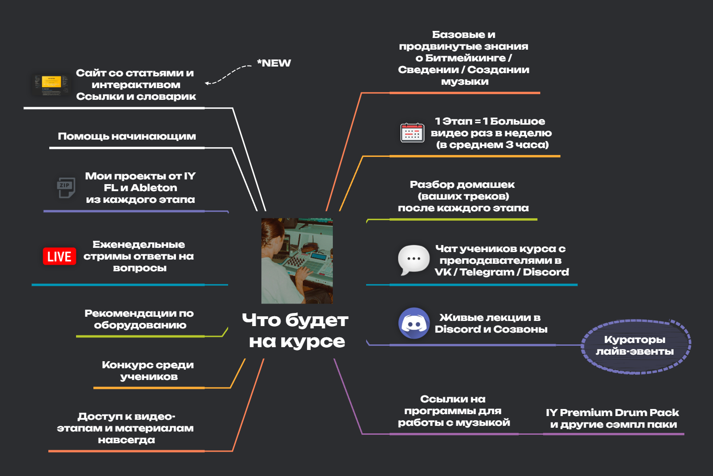

10 видео-модулей · 30+ часов уроков

## Этапы курса

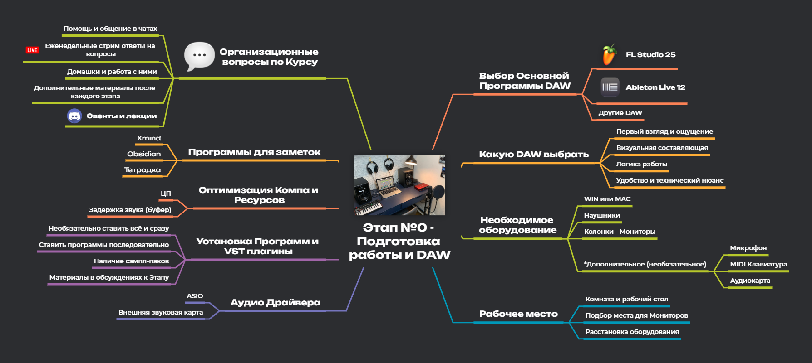

ЭТАП №0
<h3>Подготовка работы и DAW</h3>

Устанавливаем и настраиваем FL Studio / Ableton, собираем рабочее пространство, знакомимся с интерфейсом. После этого этапа вы готовы писать первый бит.

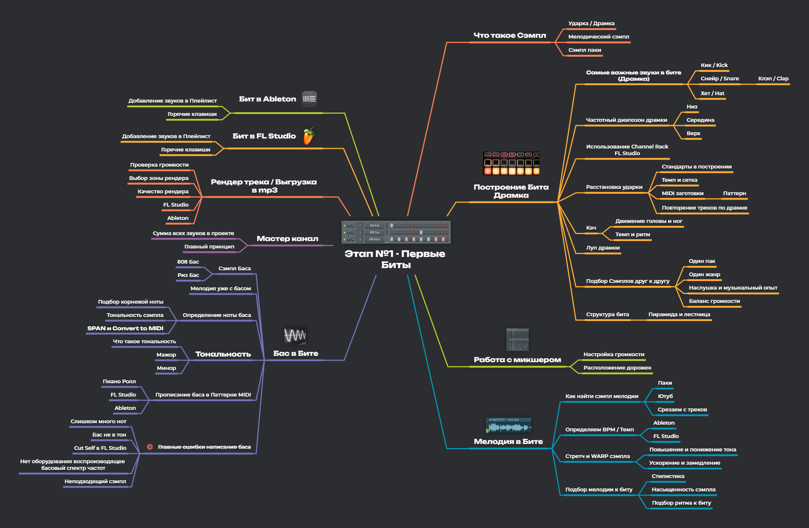

ЭТАП №1
<h3>Первые биты</h3>

Сэмплирование, драмка, построение бита. Пишем первые треки и разбираем, как устроен продакшн изнутри.

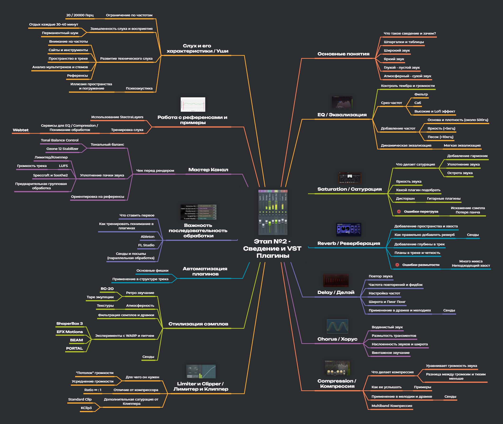

ЭТАП №2
<h3>Сведение и VST плагины</h3>

Учимся сводить треки, разбираем необходимые VST плагины: эквалайзеры, компрессоры, эффекты. Все паки звуков предоставляются в курсе.

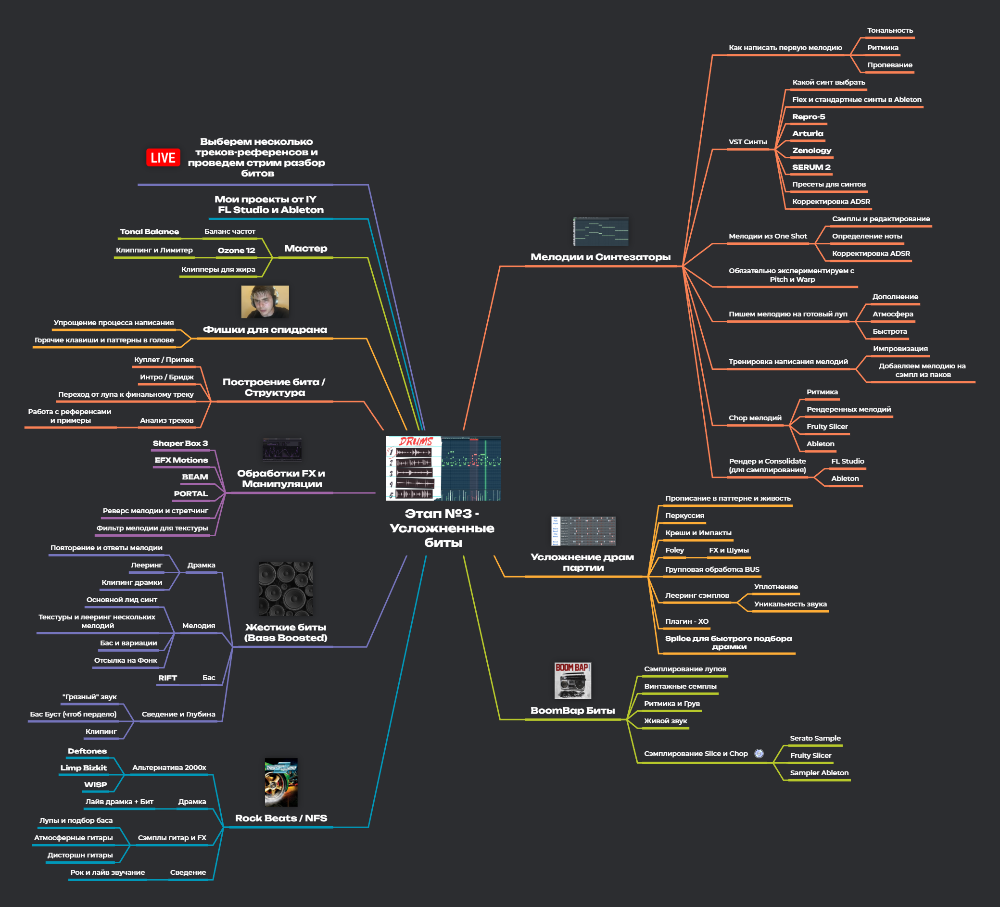

ЭТАП №3
<h3>Усложнённые биты и первые мелодии</h3>

Идём дальше простых паттернов: гармония, мелодические линии, структура трека. Ваши домашки прослушиваем и разбираем.

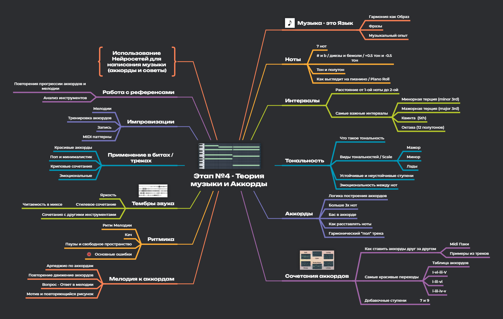

ЭТАП №4
<h3>Теория музыки</h3>

Аккорды, лады, прогрессии — только то, что реально нужно битмейкеру. После этого этапа мелодии пишутся осознанно, а не «на слух».

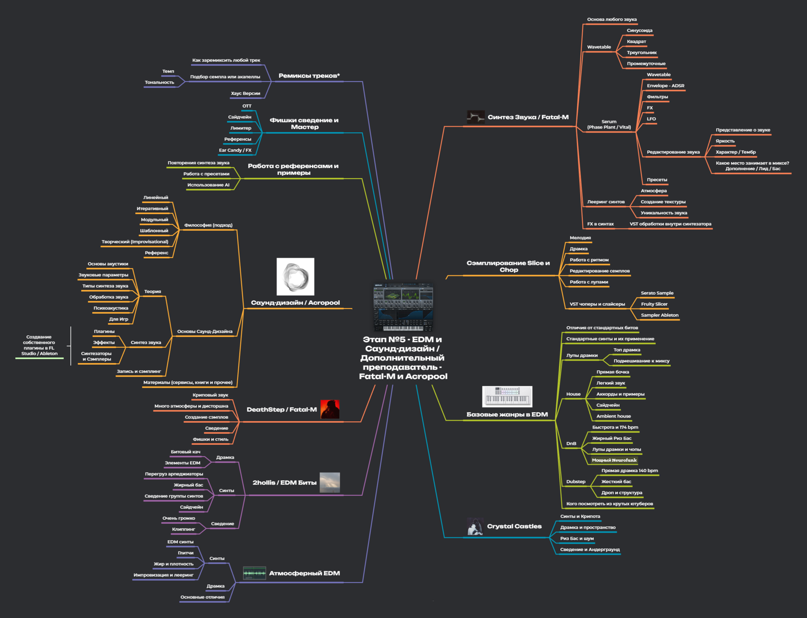

ЭТАП №5
<h3>EDM жанры и работа с синтами</h3>

Синтез, саунд-дизайн, жанровая специфика EDM. Модуль ведёт куратор Acropool (Ivan Shorstkin) — EDM продакшн и саунд-дизайнер.

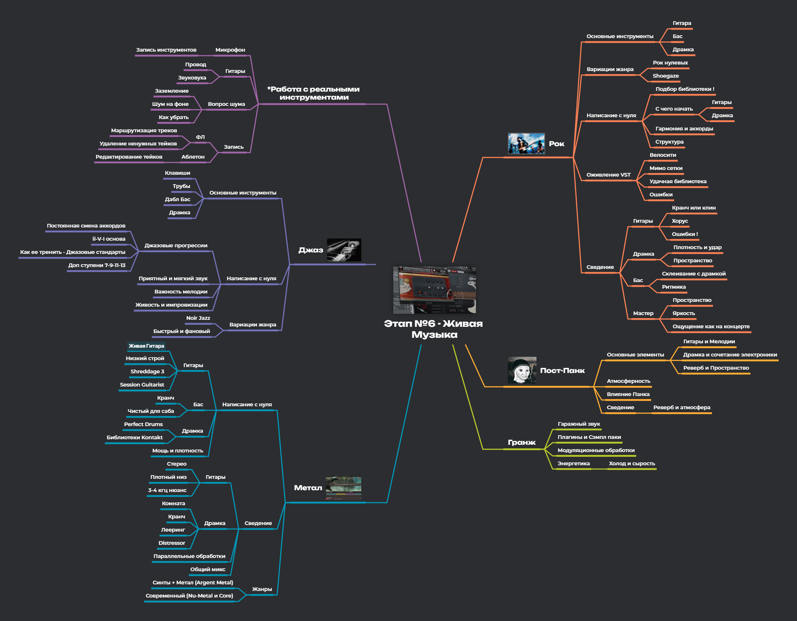

ЭТАП №6
<h3>«Живые» жанры</h3>

Рок, джаз, метал, пост-панк, гранж: написание с нуля на VST плагинах — гитары, бас, драмка. Работа с реальными инструментами и их записью.

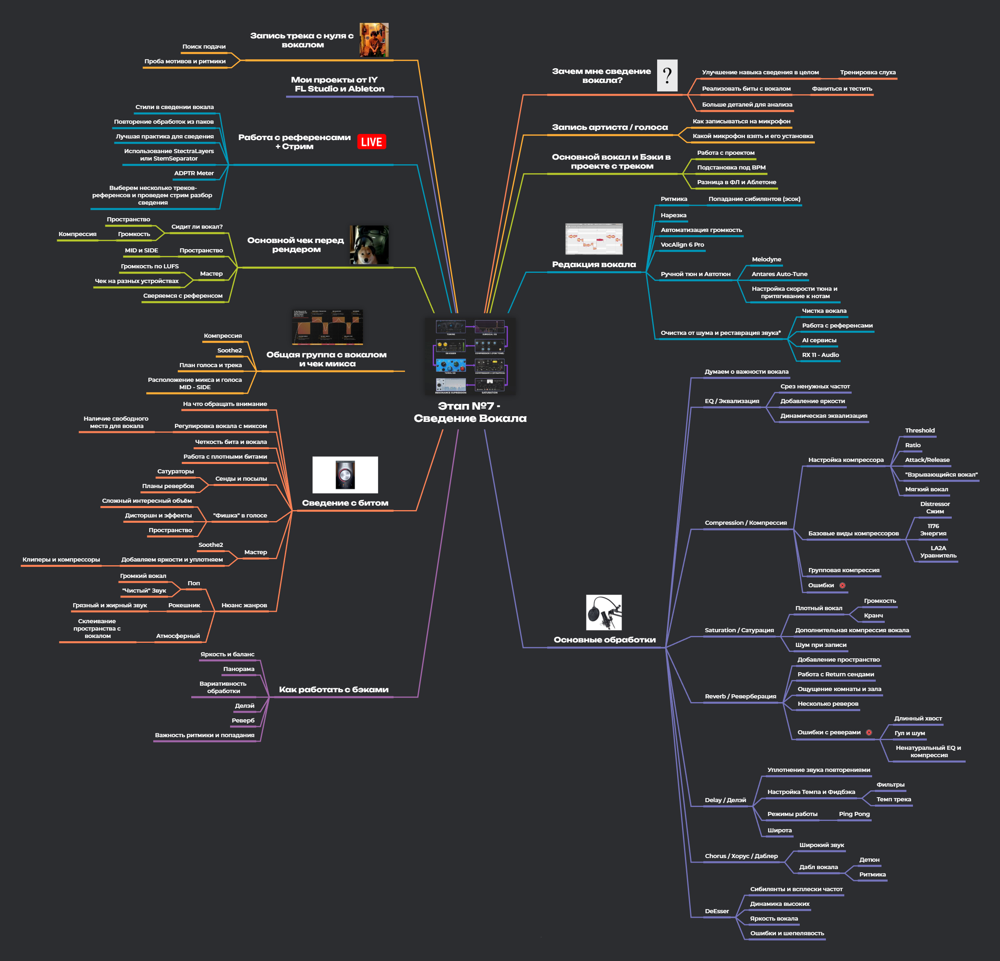

ЭТАП №7
<h3>Сведение вокала</h3>

Запись вокала дома, обработка: эквализация, компрессия, реверберация, авотюн. Разбираем типичные ошибки и учимся получать чистый звук.

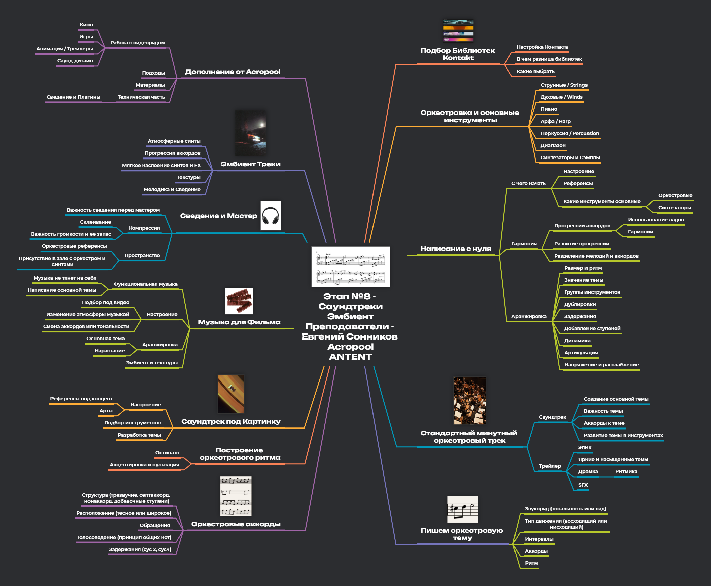

ЭТАП №8
<h3>Саундтрек, Оркестр, Эмбиент</h3>

Оркестровые библиотеки, драматургия саундтрека, эмбиент-продакшн. Расширяем палитру звуков за пределы битмейкинга.

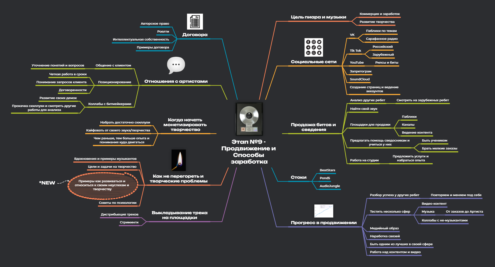

ЭТАП №9
<h3>Продвижение и продажа музыки</h3>

Выпуск треков на стриминговые площадки, дистрибуция, продвижение. Огромный плюс этапа — годной информации по этой теме почти нет нигде.

Формат

## Что входит в курс

<i data-lucide="clapperboard" class="lcard-icon"></i>
<h3>10 видео-модулей</h3>

30+ часов детальных уроков с экрана DAW. Пересматривайте в любое время без ограничений.

<i data-lucide="radio" class="lcard-icon"></i>
<h3>Еженедельные стримы</h3>

Живые трансляции с разбором домашних заданий. Задавайте вопросы и получайте ответы в реальном времени.

<i data-lucide="messages-square" class="lcard-icon"></i>
<h3>Закрытые чаты</h3>

Discord и Telegram с единомышленниками. Нетворкинг, коллаборации и поддержка сообщества.

<i data-lucide="message-circle-heart" class="lcard-icon"></i>
<h3>Персональный фидбэк</h3>

Преподаватели проверяют домашние задания и дают персональные рекомендации по каждому треку.

Команда

## Преподаватели и кураторы

Каждый — профессионал в своём деле. Кураторы организуют ивенты, создают дополнительные материалы по музыкальному продакшну и каждый день отвечают на вопросы.

<!-- TODO: сопоставить фото с людьми (photo-1/2/3.jpg) -->

<h3>IY (Иван Юрченко)</h3>
автор курса

Битмейкер, продюсер, автор топовых курсов по созданию музыки и сведению треков.

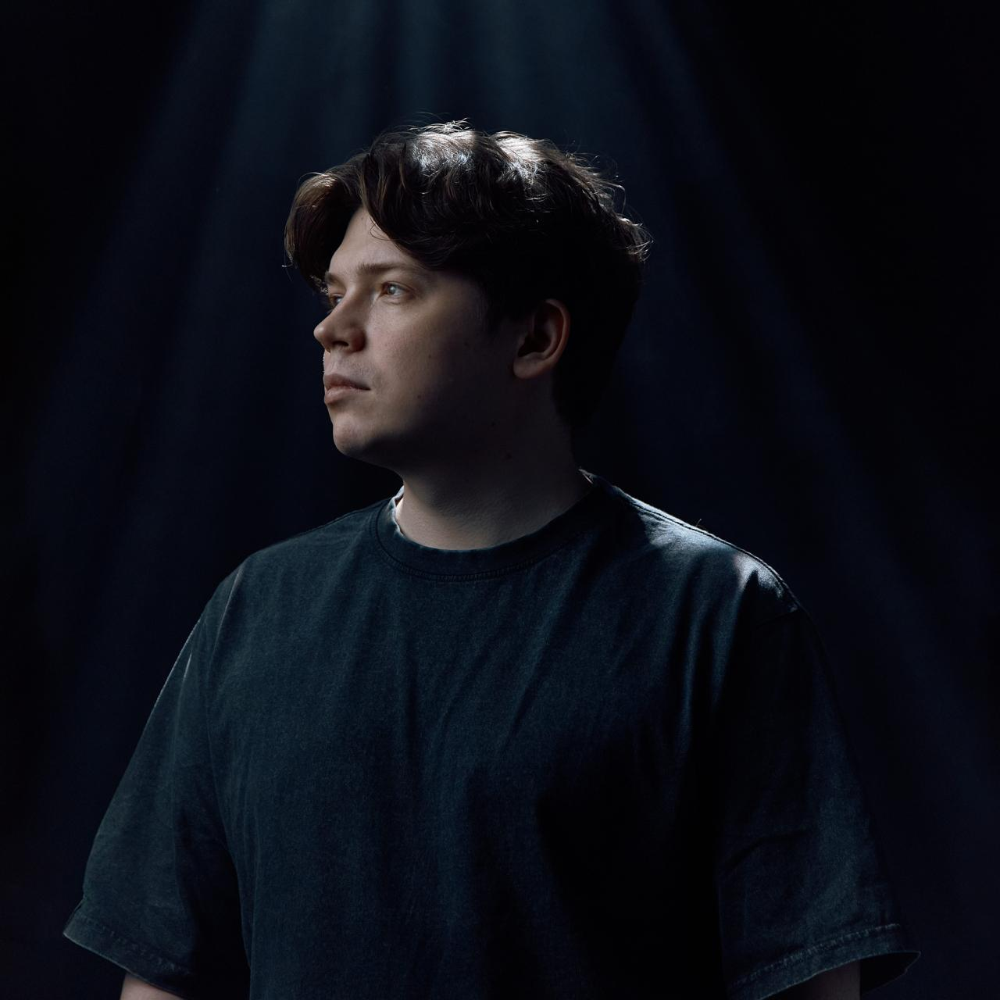
<h3>Ivan Shorstkin (Acropool)</h3>
куратор потока · EDM

EDM продакшн и саунд-дизайнер, ведёт модуль по EDM жанрам.

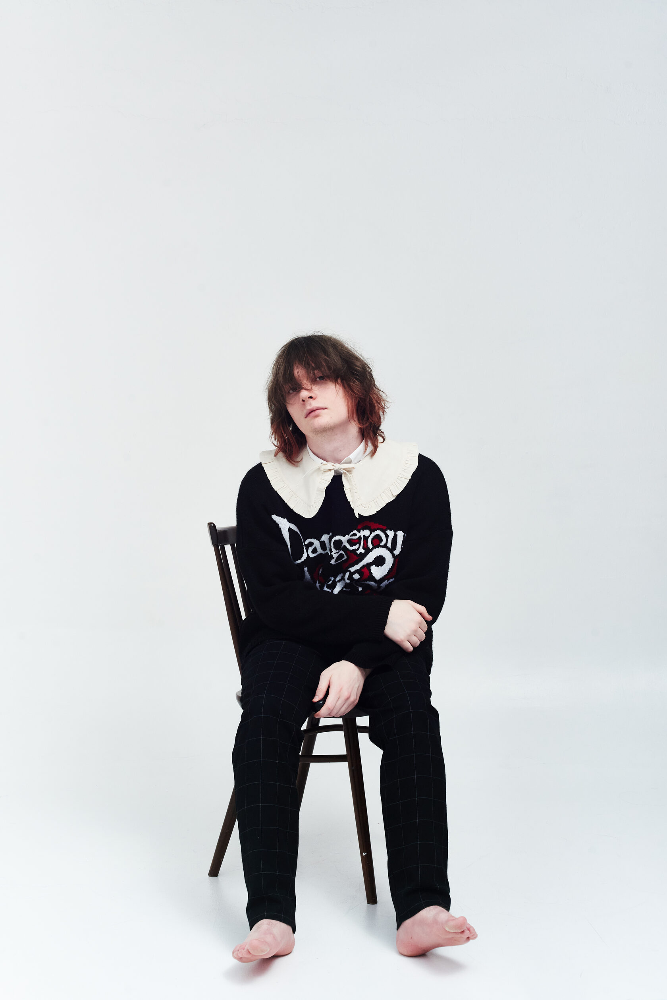
<h3>Antent</h3>
преподаватель · Ambient

Ambient артист, десятки миллионов прослушиваний на Spotify.

<h3 style="margin-top:2.2rem;">Seventy Kush</h3>
куратор · вокал

Рэп-исполнитель, расскажет как записываться дома.

<h3 style="margin-top:2.2rem;">Meraki</h3>
куратор потока

Битмейкер, ивенты в Discord и помощь в чатах.

<h3 style="margin-top:2.2rem;">Fatal-M</h3>
куратор

Дополнительные материалы и помощь студентам.

Отзывы выпускников

## Что говорят студенты

Огромный плюс за этап с продвижением музыки. Щас мало можно найти годной инфы на эту тему. Огромное спасибо!!

— выпускник потока

Ребят, если б в государственных учреждениях так преподавали, клянусь, я бы был лютым ботаном!!

— выпускник потока

Всё очень классно, мне всё понравилось!!! Спасибо вам большое!! Я ни капли не жалею что решился всё таки записаться на поток!!!

— выпускник потока

<!-- TODO: собрать отзывы с именами и потоками (как у podlesnytwins) -->

FAQ

## Частые вопросы

### Общие вопросы о IY Beats

Кто такой IY Beats?

Иван Юрченко — битмейкер, продюсер, автор топовых курсов по созданию музыки и сведению треков. Интервью и подкасты: <a href="https://youtube.com/watch?v=qHiD2vsx7os" target="_blank">YouTube</a>.

Сколько подписчиков у IY Beats в соцсетях?

51 000+ ВКонтакте, 293 000+ на YouTube (<a href="https://youtube.com/@IYBeats" target="_blank">@IYBeats</a>), Telegram — <a href="https://t.me/IY_beats" target="_blank">t.me/IY_beats</a>.

Где слушать музыку IY Beats?

Spotify, Apple Music, Яндекс.Музыка и другие стриминговые площадки.

### О курсе «Поток по Созданию Музыки»

Что такое «Поток» от IY Beats?

Структурированный онлайн-курс по созданию музыки с нуля: битмейкинг, сведение, теория музыки, выпуск треков, саундтреки, EDM продакшн, сведение вокала.

Сколько потоков было у IY Beats?

Начиная с первого потока шло улучшение качества и проверка новых форматов. 18 поток — актуальный набор.

Чем отличаются разные потоки IY Beats?

Каждый новый поток обновляет программу, добавляет новые темы и кураторов.

Можно ли пройти курс без опыта?

Да, курс создан для новичков с нуля + более сложный материал для любителей.

Сколько длится обучение в потоке?

10 видео-модулей, 30+ часов уроков + еженедельные стримы. Доступ к материалам — без ограничений по времени.

### Стоимость и запись

Сколько стоит курс?

Актуальная цена — в группе ВКонтакте и телеграм-канале. <!-- TODO: после подключения ЮKassa: цена + кнопка покупки, доступ открывается автоматически -->

Как записаться на поток IY Beats?

Напишите в паблик ВКонтакте или в директ Telegram — поможем с записью. <!-- TODO: после LMS: «купить на сайте, доступ откроется автоматически» -->

Есть ли рассрочка на обучение?

Возможно будет — уточняйте при записи.

### Технические вопросы

В каких программах обучает IY Beats?

FL Studio 25 и Ableton Live 12. Техники универсальны и переносятся на другие DAW.

Какой компьютер нужен для курса?

Любой Mac или Windows, наушники и колонки (бытовые или мониторные).

Нужно ли покупать VST плагины отдельно?

Нет. Все необходимые паки звуков и VST предоставляются в курсе.

### Преподаватели

Кто преподаёт в потоке IY Beats?

Иван Юрченко (IY), Fatal-M, Ivan Shorstkin (Acropool), Antent, Seventy Kush, Meraki и другие кураторы.

Что делают кураторы и преподаватели?

Организуют ивенты для учеников, создают дополнительные материалы по музыкальному продакшну, помогают каждый день отвечать на вопросы.

Кто такой Acropool / Ivan Shorstkin?

EDM продакшн и саунд-дизайнер, куратор модуля по EDM жанрам.

### Результаты и карьера

Что я смогу делать после курса IY Beats?

Писать биты, сводить треки, использовать VST, выпускать музыку на площадках, записывать и сводить вокал, писать рок-музыку на VST плагинах. Понимать, как работает битмейкинг в FL Studio 25, Ableton Live 12 и других DAW.

Помогает ли IY Beats с выпуском музыки?

Да. В финальном этапе разбираем выпуск треков на стриминговых платформах.

Можно ли зарабатывать на музыке после курса?

Курс даёт базу для карьеры битмейкера/продюсера и звукорежиссёра, которая позволяет получать первые заказы и заработок.

### Сообщество

Где общение между студентами IY Beats?

ВК группа, Discord и Telegram чаты, еженедельные стримы с ответами на вопросы и проверкой домашек-треков, ивенты.

Можно ли коллаборировать с другими студентами?

Да. В закрытых чатах нетворкинг и коллаборации поощряются.

## Готов начать?

Напиши в паблик IY для записи на поток — поможем выбрать формат и ответим на все вопросы.

<a class="btn-primary" href="https://vk.com/iy_beats" target="_blank">ВКонтакте</a>
<a class="btn-secondary" href="https://t.me/IY_beats" target="_blank">Telegram</a>

compose.ivan@yandex.ru · <a href="https://t.me/IY_beats" target="_blank">t.me/IY_beats</a> · <a href="https://vk.com/iy_beats" target="_blank">vk.com/iy_beats</a> 
<a href="/oferta/">Договор публичной оферты № 1</a>

